# logistics-back( 物流管理系统后端 ）

基于 SpringBoot 2.0 + Layui2 框架的物流管理系统，采用前后端分离，这是后端项目

<p align="center">
	
	
	
	
</p>

---
2018.10.24 更新

- 上传了遗漏的application.properties文件
- 如果大家遇到了类似的文件缺失问题，欢迎提交issue给我，我会尽快处理

---
2018.09.08 更新

- 上传案例sql脚本
- 可登录用户： { username: GL846489, password: 123456 } 
- 修复 User.java 和 ClearController.java 代码bug

---

> 作者和小伙伴是准大四学生，该项目的原型来自一个课设，所以各方面功能的设计以及后面的代码都缺乏可用性  
> 这是作者的第一个 Springboot 项目，主要以学习为主  
> 后面将会上线一个基于 SpringBoot + SpringCloud + Vue 这样架构的前后端分离项目（不再是这样的伪分离啦），敬请期待  
> 如果这个项目觉得很 low，请勿喷

- 个人博客地址：https://www.ltysyn.cn/?p=173
- csdn 地址：https://blog.csdn.net/ansellyy/article/details/81099922
- 前端项目地址：https://github.com/anselleeyy/logistics-front
- 欢迎大家 star 或者 fork

<!-- TOC -->

- [项目文档](#项目文档)
    - [项目需求说明](#项目需求说明)
    - [项目技术选型](#项目技术选型)
        - [编写环境](#编写环境)
        - [架构选型](#架构选型)
            - [前端](#前端)
            - [后端](#后端)
    - [功能模块介绍](#功能模块介绍)
        - [票据管理](#票据管理)
            - [票据分发](#票据分发)
            - [票据查询](#票据查询)
        - [接货管理](#接货管理)
            - [填写接货单](#填写接货单)
            - [查询接货单](#查询接货单)
        - [配车管理](#配车管理)
            - [填写运输合同](#填写运输合同)
            - [查询运输合同](#查询运输合同)
        - [到货管理](#到货管理)
            - [司机到货回执](#司机到货回执)
            - [客户到货回执](#客户到货回执)
        - [中转管理](#中转管理)
            - [中转公司](#中转公司)
            - [中转信息](#中转信息)
        - [结算管理](#结算管理)
            - [货运单结算](#货运单结算)
            - [运输结算](#运输结算)
            - [代收货款结算](#代收货款结算)
            - [其他杂费结算](#其他杂费结算)
            - [预期未到](#预期未到)
        - [客户服务](#客户服务)
            - [到货回告](#到货回告)
            - [提货回告](#提货回告)
            - [中转回告](#中转回告)
            - [已提回告](#已提回告)
        - [监控分析](#监控分析)
        - [成本核算](#成本核算)
        - [应用管理](#应用管理)
            - [客户管理](#客户管理)
            - [司机管理 | 职员管理](#司机管理--职员管理)
            - [线路管理](#线路管理)
        - [系统管理](#系统管理)
            - [新建用户组](#新建用户组)
            - [修改用户组信息](#修改用户组信息)
            - [分配用户组功能](#分配用户组功能)
            - [密码修改](#密码修改)

<!-- /TOC -->
## 项目需求说明

首先，发货客户与快递公司签订货运合同(货运单)，把货物交给快递公司来托运，并按照货运合同的付款方式付款。快递公司根据货物运输线路，为货物配车，找到合适的车辆后，与司机签订运输合同(回执单)，并按照运输合同的运费结算方式结算。司机对货物检查无误后，装车，然后发车，发车后，货物的任何损失由司机承担。司机到达目的地后，需要经过货物验收，验收通过，填写一份司机回执单，快递公司这时同时通知发货客户和收货客户，货物已到达。如果货物没有通过验收，则填写差错记录。如果该货物不需要中转，通知收货客户来提货，客户验收通过后，填写客户回执单，快递公司这时通知发货客户，所发货物已被提走。如果该货物需要中转，则填写一份中转信息单，快递公司这时同时通知发货客户和收货客户，货物已被中转。中转成功后，收货客户来提货，并通知发货客户，货物已被提，然后进行转货结算。

## 项目技术选型

### 编写环境

- Windows10 专业版 - 1803
- Spring Tool Suite 3.9.4.RELEASE
- Spring5 + SpringMvc5 + Spring-Data-Jpa
- Mysql 8.0.11

### 架构选型

> 项目前后端分离，降低耦合度

#### 前端

> 前端选用 layui 2.3.0，以 html 的形式保存，通过 js 向后端请求数据

#### 后端

> 后端选用 SpringBoot 2.0.2 进行快速的原型开发，内部采用SSH（Spring + SpringMVC + Hibernate）

**特色**  

1. Hibernate 采用 SpringBoot-data-jpa 进行封装，简化数据库操作，采用命名规范进行数据库的增删改查，去除了接口的实现
2. 使用 Springboot 进行快速开发，简化了配置文件的编写
3. 项目中采用了 Swagger2.0，自动扫描 Controller 中的 RequestMapping，形成接口文档

接口截图文档如下：
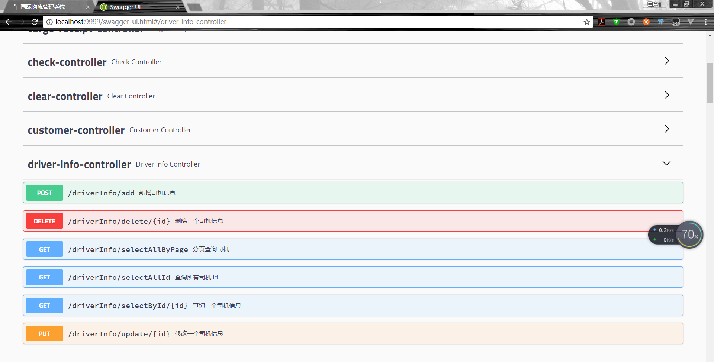

## 功能模块介绍

### 票据管理

**票据管理主要是对票据信息进行分发和历史票据的查询**

#### 票据分发

> 票据分发主要是对货运单进行司机分配，分发后，该货运单以及相应的货运回执单的状态会被更新为未到运单和未到车辆，同时更新发货时间

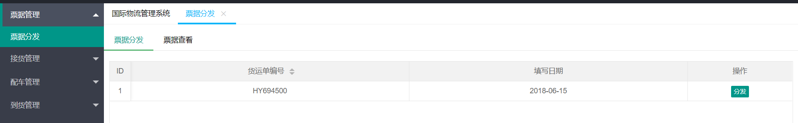
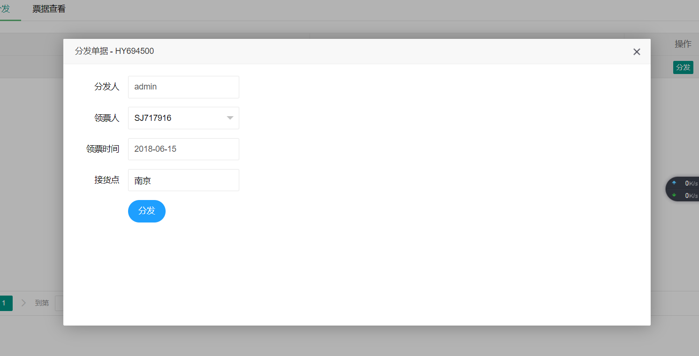

#### 票据查询

> 票据查询主要是查询所有的历史票据

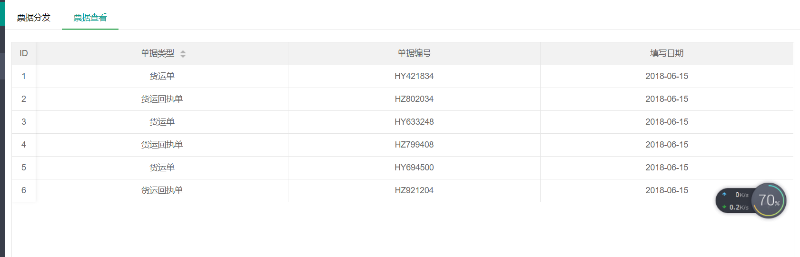

主要进行货运单的分发（分发到司机）及历史单据的查询

### 接货管理

**接货管理主要由工作人员负责填写一份货运单合同。合同中发货客户和收货客户信息都是下拉选择后自动查找数据库返回前台，职员编号通过获取当前登录用户的编号自动填写。实际交货日期、是否有效、是否审核都是禁止填写，后续事件触发后自动补充填写。提交合同后，货运单事件表修改该合同状态为待运，票据状态为已填。填完货运单后，自动跳转添加货物信息**

#### 填写接货单

> 接货单中，部分信息由数据库读取自动生成  
> 接货单中的发货和收货客户由数据库返回前端显示
> 中转地及中转费在填写完发货地和收货地后，根据路线情况动态生成  
> 添加货运单的同时自动生成货运单号，以HY开头，提交合同后，添加票据，类型为货运单，状态为已填，修改货运单事件表状态为待发

``` java
String goodsBillCode = "HY";
while (true) {
goodsBillCode += randomCode();
	if (goodsBillDao.findByGoodsBillCode(goodsBillCode) == null) {
		break;
	}
}
goodsBill.setGoodsBillCode(goodsBillCode);
goodsBill.setValidity("无效");
goodsBill.setIfAudit("未审核");
goodsBill.setIfSettleAccounts("未结账");
goodsBillDao.save(goodsBill);
			
BillInfo billInfo = new BillInfo();
billInfo.setBillType("货运单");
billInfo.setBillCode(goodsBillCode);
billInfo.setBillState("已填");
billInfo.setWriteDate(new Date());
billInfoDao.save(billInfo);
			
GoodsBillEvent goodsBillEvent = new GoodsBillEvent();
goodsBillEvent.setGoodsBillId(goodsBillCode);
goodsBillEvent.setEventName("待发");
goodsBillEvent.setRemark("单据已填");
goodsBillEvent.setOccurTime(new Date());
goodsBillEventDao.save(goodsBillEvent);
```

> 添加货物后，给回执单一个编号，以HZ开头，并且修改货运单状态为有效和已填

``` java
String goodsRevertBillId = "HZ";
while (true) {
	goodsRevertBillId += randomCode();
	if (cargoReceiptDetailDao.findByGoodsRevertBillId(goodsRevertBillId) == null) {
		break;
	}
}
goodsBill.setValidity("有效");
goodsBill.setIfAudit("审核");
```

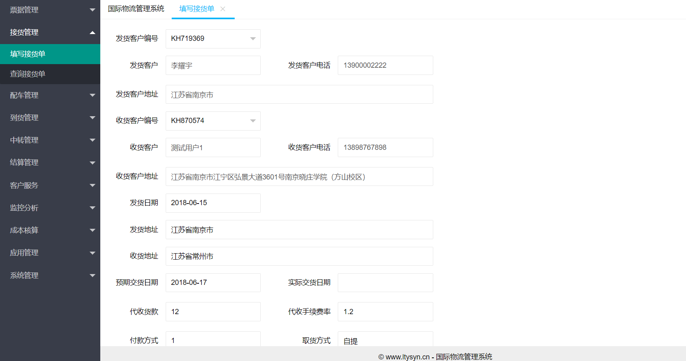


#### 查询接货单

**查询页面可以查看不同状态的货运单：待发运单、未到运单、未结运单、所有运单。页面以分页形式展示货运单编号、事件名称、备注、发生时间等简略信息。只有在待运状态的货运单，才有修改和删除功能，其他状态不能对其数据操作。所有页面都可以通过货运单编号查看详情。**

> 刚填写好后的接货单将会以待发的状态保存在待发运单中

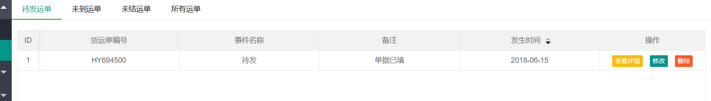

> 可以查看运单的详细内容

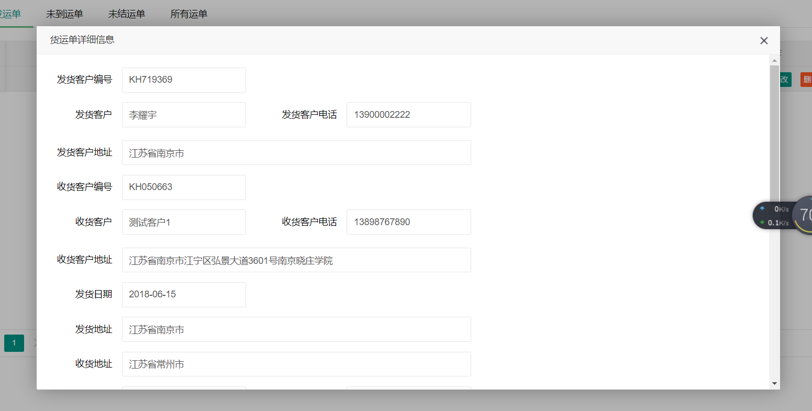

> 对待发运单可以进行修改或删除  
> 删除货运单时只能修改货运单及票据状态，不能真正删除

``` java
GoodsBillEvent goodsBillEvent = new GoodsBillEvent();
goodsBillEvent.setGoodsBillId(goodsBillCode);
goodsBillEvent.setEventName("删除货运单");
goodsBillEvent.setRemark("顾客不想发货");
goodsBillEvent.setOccurTime(new Date());
		
BillInfo billInfo = billInfoDao.findByBillCode(goodsBillCode);
billInfo.setBillState("作废");
```

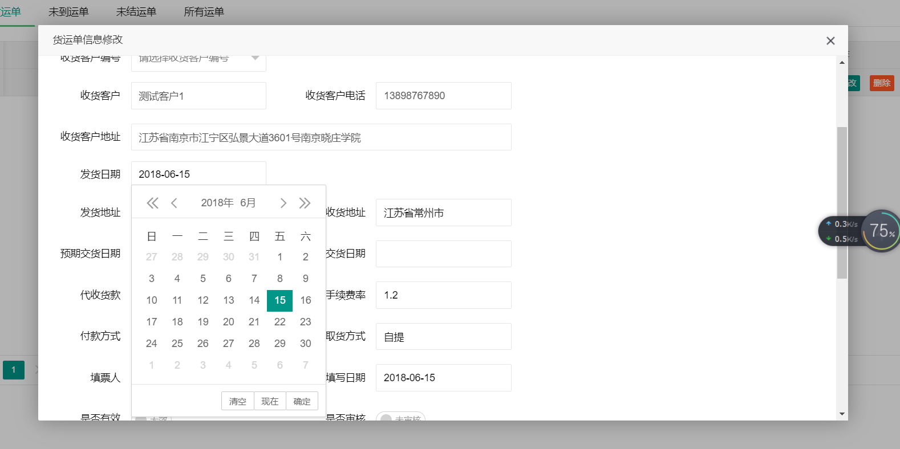

### 配车管理

**主要进行货运回执单的填写。下拉选择未填写的货运回执单,选择后数据库查询联系人、地址等信息直接填写到页面。货运单状态自动填写为未出合同。
装货地点下拉选择，能找到所有路线的出发地，交货地点后台根据装货地点查询能到达的相应目的地供工作人员选择。起运时间和司机编号在分发票据的时候自动补充填写。是否结算在结算页面事件触发更改。

查询页面可以查看运输合同在不同阶段的状态：未出合同、未到合同、未结车辆、所有合同。页面以分页形式展示货运回执单编号、回执单状态、收货联系人等大致信息。只有运输合同状态为未出合同时，才有修改和删除功能，其他状态不能对其进行数据操作。所有页面都可以通过货运单编号查看详情**

#### 填写运输合同

> 填写主要是填写货运回执单主表，后端会检索数据库中没有运输合同的信息，从而显示在下拉框中，填票人选择相应的货运单后，会返显部分信息  
> 填写后运输合同将处于未出合同状态  
> 添加货运回执单的同时添加票据，类型为货运回执单，状态为已填，修改货运单事件表状态为待发。

``` java
BillInfo billInfo = new BillInfo();
billInfo.setBillType("货运回执单");
billInfo.setBillCode(cargoReceipt.getGoodsRevertBillCode());
billInfo.setBillState("已填");
billInfo.setWriteDate(new Date());
billInfoDao.save(billInfo);
```

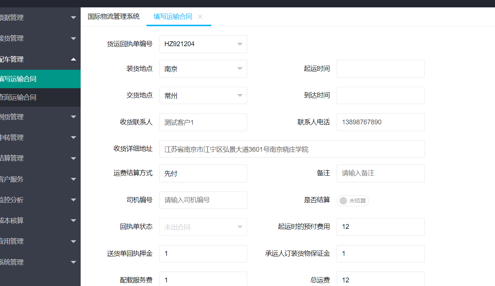

#### 查询运输合同

> 可以查询未出合同、未到车辆、未结合同、所有合同4个状态的货运回执单

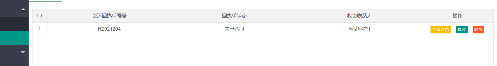

> 可以查看未出合同的详细信息并进行修改、删除操作  
> 删除货运回执单时只能修改货运单及票据状态，不能真正删除

``` java
BillInfo billInfo = billInfoDao.findByBillCode(goodsRevertBillCode);
billInfo.setBillState("作废");
billInfo.setWriteDate(new Date());
```

*操作同接货类似，在此不重复展示*

### 到货管理

司机可以在此进行到货回执的填写、用户可以填写顾客回执，并进行历史货物的查询
**到货主要分两个部分：1. 司机填写到货回执，确认货物到货；2. 客户填写收货回执，确认收货**

#### 司机到货回执

> 司机填写到货回执，同时后端更新货运单和货运回执为未结；同时客服可以进行提货回告和到货回告并进行填写

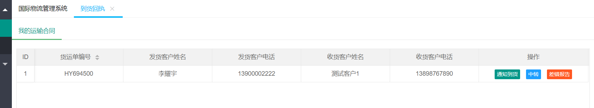
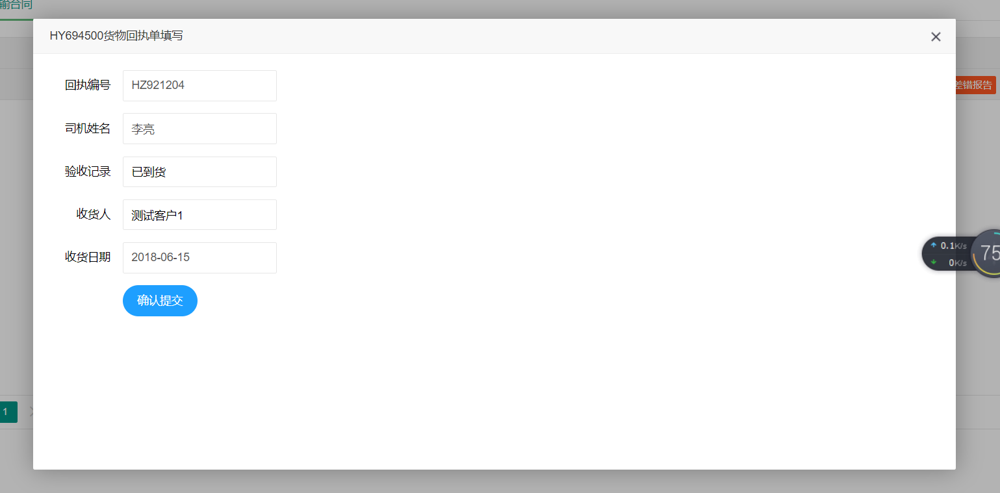

#### 客户到货回执

> 客户填写到货回执后，同时客服可以进行收货回告

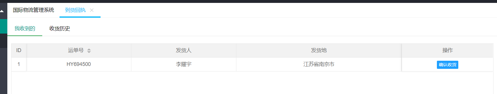
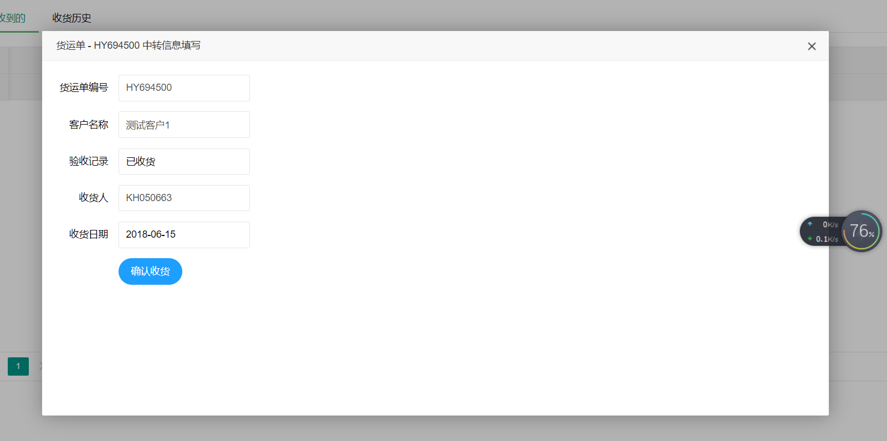

> 客户可以查询自己的收货历史

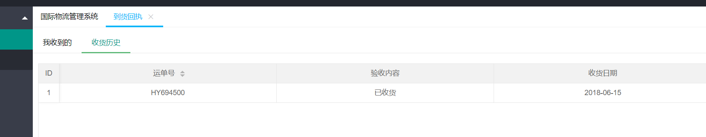

### 中转管理

**中转管理主要是进行中转公司信息的填写、查询以及对货物中转信息的录入和历史查询**

#### 中转公司

> 选择某一个城市，并对该城市的中转公司信息进行录入

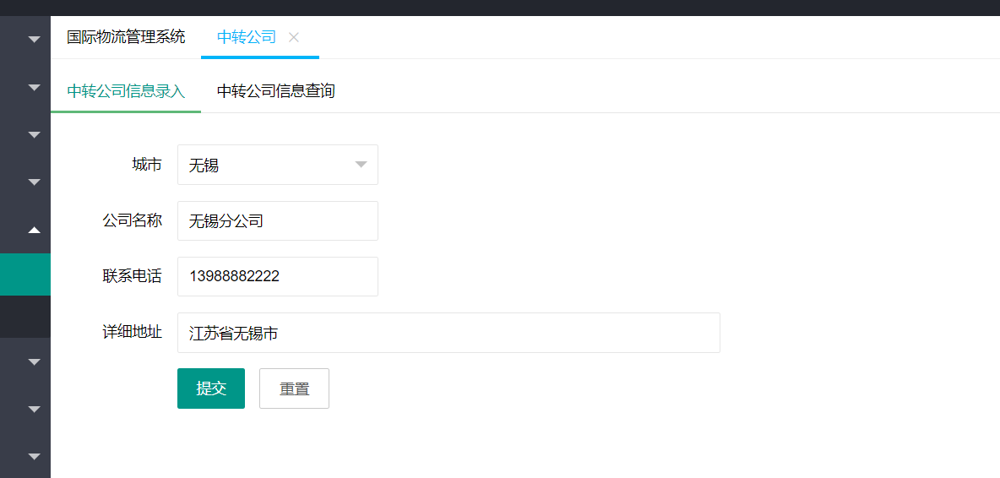

> 可以在中转公司信息查询中查询所有的中转公司信息

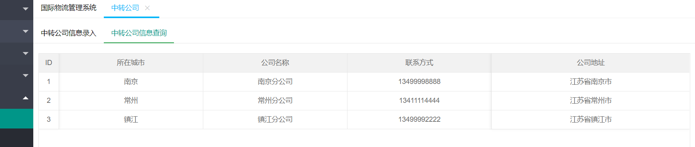

#### 中转信息

> 中转信息主要是填写中转货物的中转信息

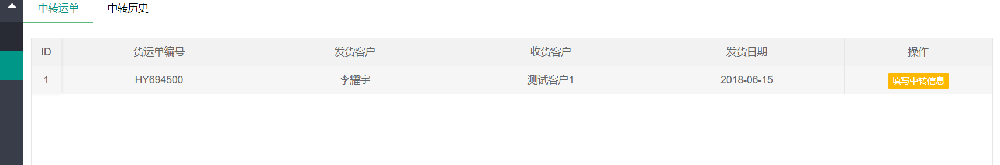


> 可以在中转历史中查询所有的中转信息

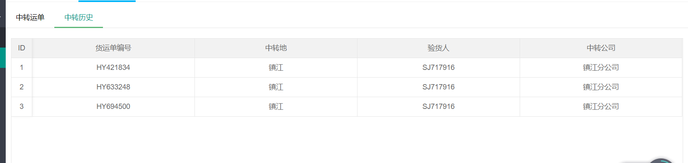

### 结算管理

**货运单结算主要是针对运货客户或者收货客户的结算。它分为未 结运单和已结运单。当本单金额+保险费-减款不等于收到金额时，为未结运单。反之为已结运单，并放到结算历史中。运输结算主要是针对司机运费的结算。它分为未结运费和已结 运费。当运费+订装费+加运费不等于已付金额时，为未结运单，当运费+订装费+加运费等于已付金额时，结算成功，并放到结算历史中。代收货款结算主要是针对客户需要代收款的情况进行结算。分未结代收货款和已结代收货款。当佣金率 * 实收货款 > 已收佣金，或者佣金率 > 0 且实收货款 = 0，或者应收佣金不等于 0 时，为未结代收结算。反之，为已结代收货款。其它费用结算主要包括实际产生的搬运费及运输中所产生的其它费用的结算**

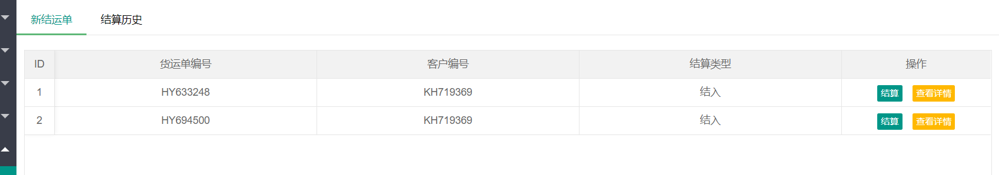
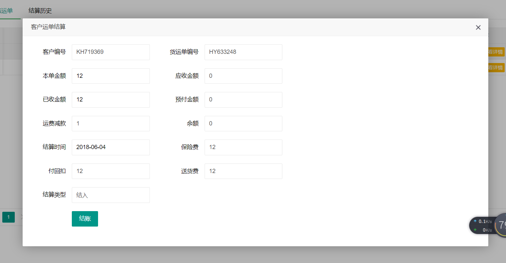


#### 货运单结算

如果是已结运单，通过GoodsBillCode查询到客户运单结算表，添加到输出集合中；
如果是未结运单，在货运单事件表中查询所有的未结运单，再通过GoodsBillCode查询到goodsBill；
    在货运单主表中查询出客户编号， 运费减款，保险费， 付回扣，送货费；
    在页面中填写已收金额，本单金额，预付金额，结算时间；
    通过 本单金额+保险费-减款-已付 计算出应收金额；
    结算时，判断 运费+定装费+加运费 是否等于 应收金额，如果不等保存，不更新状态；如果相等，更新事件表中状态为已结运单。

#### 运输结算

如果是已结合同，通过GoodsBillCode查询到司机运单结算表，添加到输出集合中；
如果是未结合同，在货运回执表中查询所有的未结合同
    在货运回执表中查询出预付金额，  定装保证金，配载服务费，保险费；
    在页面中填写已付金额，承运费，加运费，结算时间；
    通过 承运费+定装费+加运费-已付 计算出余额；
    结算时，判断 运费+定装费+加运费 是否等于 已付金额，如果不等保存，不更新状态；如果相等，更新回执表中状态为已结运单。

#### 代收货款结算

如果是已结代收货款，通过GoodsBillCode查询到代收货款结算表，添加到输出集合中；
如果是未结运单，在货运单事件表中查询所有的未结运单，再通过GoodsBillCode查询到goodsBill，判断其代收货款是否为空，如果不是，则代表需要代收货款结算；
    在货运单主表中查询出 客户名称，实收货款，变更；
    在页面中填写已收佣金，结算时间；
    通过 实收货款 * 佣金率 - 已收佣金 计算出应收佣金；
    结算时，判断佣金率*实收货款 是否大于 已收佣金，或者佣金率>0且实收货款=0，如果不是保存，不更新状态；如果是，更新事件表中状态为已结运单。

#### 其他杂费结算
将页面中输入的信息保存到数据库中。

#### 预期未到

从货物回执表中查询到货时间和起运时间，时间差为实际中转天数，如果大于中转天数，则说明是预期未到运单。

**滞留未取：** 从货物回执表中查询到货时间，从货运单主表中查询实际交货时间，时间差为到货后取货天数，如果大于3天，则说明是三天未取。
**客户运量排行：** 在货运单主表中，根据发货客户分组，查出发货人相同的信息，算出运费和，保险费总计，件数总计，并按照件数总计降序排序。
**司机运量排行：** 在司机结算表中，根据司机编号分组，查出司机编号相同的信息，算出承运费和，加运费总计，数量总计，并按照总计降序排序。
**车辆成本统计表：** 将司机信息表和司机结算表中的信息拼接，在司机结算表中，根据司机编号分组，查出司机编号相同的信息，算出承运费和，加运费总计，数量总计，并按照总计降序排序，根据查询出的信息中的司机编号，查询司机信息表，查询出准载重量，茶香宽度等信息。
**往来业务分析报表：** 每一个货运单代表一个往来业务，可以从货运单主表初中查询到每一个往来业务信息表中的信息。
**专线整体成本分析报表：** 在货运单回执表中，根据装货地点和交货地点分组，查出装货地点和交货地点相同的信息，算出运费和，保险费和，数量总计，并按照件数总计降序排序。

### 客户服务

**客户服务包括到货回告、提货回告、中转回告、已提回告**

#### 到货回告

> 到货回告是在司机填写货物回执单后，由客户拨打电话提示发货人后，进行相应的记录

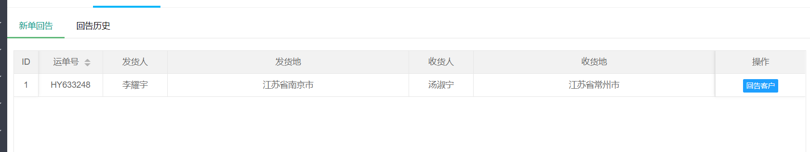


> 可以在到货历史中查询到所有的到货回告记录，并进行详情查看

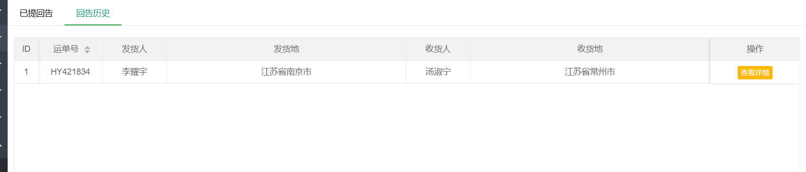
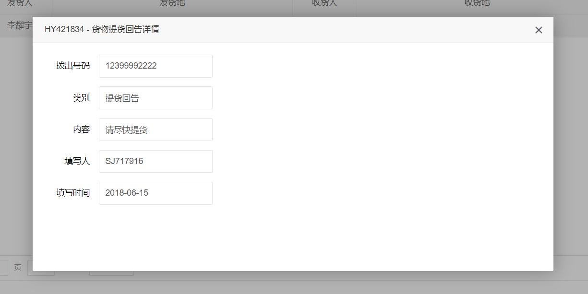

#### 提货回告

> 提货回告是在司机填写货物回执单后，由客户拨打电话提示收货人来收货后，进行相应的记录

***相应的操作同到货回告类似，在此不进行重复展示

#### 中转回告

> 中转回告是在中转货物到达中转公司，并由中转公司再次发出货物后，由客户拨打电话提示发货人和收货人双方后，进行相应的记录

***相应的操作同到货回告类似，在此不进行重复展示

#### 已提回告

> 已提回告是在收货人填写了收货回执后，由客户拨打电话提示发货人后，进行相应的记录

***相应的操作同到货回告类似，在此不进行重复展示

### 监控分析

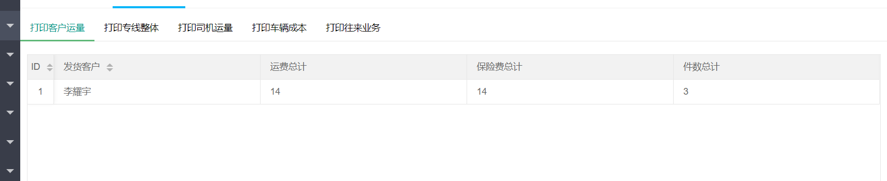

### 成本核算

> 营业外收入通过页面传值返回后台，并以分页形式展示详情。  
> 在后台查询一个月内的所有营业外收入，以便月报核算：根据收入月份IncomeMonth在extraIncome表中查询对应的营业外收入。  

> 营业收入管理需要在后台对货运回执单主表查询一个月内的所有运费、保险费，以便月报核算：根据签订时间SignTime在cargoreceipt表中查询本月的所有运费、保险费。

> 工资管理通过页面传值返回后台，并以分页形式展示详情。点击查询按钮可查看当前员工的具体工资信息。
在后台查询一个月内的所有工资情况，以便月报核算：根据日期date在employeewage表中查询对应的基本工资、岗位工资、津贴。

> 财务费用管理通过页面传值返回后台，并以分页形式展示详情。在后台查询一个月内的所有财务费用，以便月报核算：根据支出月份payoutMonth在financefee表中查询对应的财务费用。

> 经营费用的管理需要在后台查询一个月内的所有搬运费、车运费，以便月报核算：根据结算日期balanceDate在extraclear表中查询对应的搬运费、车运费。

> 管理费用通过页面传值返回后台，并以分页形式展示详情。点击查询按钮可查看当前费用的具体信息。在后台查询一个月内的所有管理费用情况，以便月报核算：根据支出月份payoutMonth在managefee表中查询对应的办公费、房租费、水电费、电话费、其他。

> 月报报表管理需要查询当前月的月报信息：将对incomemonthlytemp表进行查询，将当前月报信息显示在页面；获取当月的时间，并在后台调用以上所提到的有关月报核算的方法，对于查询出的各项收入、支出条目计算出各项的一个月总金额，并将这些总金额分别对应保存到incomemonthlytemp表中（其中非营业收入、运费金额、保险金额、车运费、搬运费、办公费、房租费、水电费、电话费、其他、财务费用、工资、月份可以直接保存）。剩余需要计算后保存的字段级算法如下：营业收入=运费金额+保险金额、收入=非营业收入+营业收入、经营费=车运费+搬运费、管理费用=办公费+房租费+水电费+电话费+其他、支出=经营费+管理费用+财务费用+工资、利润=收入-支出

营业收入:
1. 运费
    根据签订时间 SignTime 在 cargoreceipt 表中查询本月的所有运费。以便月报核算。
2. 保险费
    根据签订时间 SignTime 在 cargoreceipt 表中查询本月的所有保险费。以便月报核算。

``` java
@Query(value = "from cargoreceipt where signTime between ?1 and ?2")
public List<CargoReceipt> findBySignTime(Date beginTime, Date endTime);
```

营业外收入：
1. 营业外收入是通过页面传入实体类进行保存的。
2. 根据收入月份IncomeMonth在extraIncome表中查询对应的金额。以便月报核算。
    public List<ExtraIncome> findByIncomeMonth(String incomeMonth);

支出（工资+经营费用+管理费用+财务费用）
    工资：
    1. 工资是通过页面传入实体类进行保存的
    2. 根据员工编号显示对应员工的工资
    ``` java
    @RequestMapping(value = "/findWage/{employeeCode}", method = RequestMethod.GET)
    ```
    3. 根据日期date在employeewage表中查询对应的工资。以便月报核算。
``` java
@Query(value = "from employeewage  where date between  ?1 and  ?2")
public List<EmployeeWage>  findByDate(Date beginTime,Date endTime);
```

经营费用
搬运费：
根据结算日期balanceDate在extraclear表中查询对应的搬运费。以便月报核算。
``` java
@Query(value = "from extraclear where balanceDate between ?1 and ?2 and subjectName = '搬运费'")
public List<ExtraClear> findByBalanceDate(Date beginTime, Date endTime);
```

管理费用：
1. 管理费用是通过页面传入实体类进行保存的
2. 根据id显示对应的管理费用的全部信息
``` java
@RequestMapping(value = "/findManageFee/{id}", method = RequestMethod.GET)
```
3. 根据支出月份payoutMonth在managefee表中查询对应的费用。以便月报核算。
``` java
public List<ManageFee> findByPayoutMonth(String PayoutMonth);
```

财务费用：
1. 财务费用是通过页面传入实体类进行保存的
2. 根据支出月份payoutMonth在financefee表中查询对应的费用。以便月报核算。
``` java
public List<FinanceFee> findByPayoutMonth(String PayoutMonth);
```

月报（获取当月的时间，从涉及的相关表中查询出当月所有支出和收入，对于查询出的每项都算总额set给月报的各项属性）
获取并保存月报信息：
1. 月份month
``` java
Calendar calendar = Calendar.getInstance(TimeZone.getTimeZone("GMT+08:00"));
String cMonth = String.valueOf(calendar.get(Calendar.MONTH) + 1);
String cYear = String.valueOf(calendar.get(Calendar.YEAR));
if (cMonth.length() == 1) {
	cMonth = "0" + cMonth;
}
String cTime = cYear + "-" + cMonth;
iMonthlyTemp.setMonth(cTime);
```

2. 工资wage
（根据时间查询当月的工资情况，当月的总工资 = 当月总基本工资 + 当月总岗位工资 + 当月总津贴）
``` java
List<EmployeeWage> employeeWages = selectByDate(bTime, eTime);
for (int i = 0; i < employeeWages.size(); i++) {
	wage += (employeeWages.get(i).getBasicWage() + employeeWages.get(i).getAllowance() + employeeWages.get(i).getStationWage());
}
iMonthlyTemp.setWage(wage);
```

3. 财务费用financeFee
（根据时间查询当月的财务费用情况，当月总财务费用 = 当月财务费用总和）
``` java
List<FinanceFee> financeFees = selectByFPayoutMonth(cTime);
for (int i = 0; i < financeFees.size(); i++) {
    fFee += financeFees.get(i).getFee();
}
iMonthlyTemp.setFinanceFee(fFee);
```

4. 管理费用 manageFee（办公费officeFee、房租费houseRent、水电费waterElecFee、电话费phoneFee、其他other）
（根据时间查询当月的管理费用情况，当月总管理费用 = 当月总办公费 + 当月总房租费 + 当月总水电费 + 当月总电话费 + 当月总其他）
``` java
List<ManageFee> manageFees = selectByMPayoutMonth(cTime);
for (int i = 0; i < manageFees.size(); i++) {
    officeFee += manageFees.get(i).getOfficeFee();
	houseRent += manageFees.get(i).getHouseRent();
	waterElecFee += manageFees.get(i).getWaterElecFee();
	phoneFee += manageFees.get(i).getPhoneFee();
	other += manageFees.get(i).getOtherPayout();
}

iMonthlyTemp.setOfficeFee(officeFee);
iMonthlyTemp.setHouseRent(houseRent);
iMonthlyTemp.setWaterElecFee(waterElecFee);
iMonthlyTemp.setPhoneFee(phoneFee);
iMonthlyTemp.setOther(other);
iMonthlyTemp.setManageFee(officeFee + houseRent + waterElecFee +phoneFee + other);
```

5. 经营费bizFee（车运费carCarriage、搬运费conveyWage）
（根据时间查询当月的经营费用，当月总经营费用 = 当月总车运费 + 当月总搬运费）
``` java
List<ExtraClear> extraClears = selectByBalanceDate(bTime, eTime);
for (int i = 0; i < extraClears.size(); i++) {
    balanceMoney += extraClears.get(i).getBalanceMoney();
}
iMonthlyTemp.setConveyWage(balanceMoney);
iMonthlyTemp.setCarCarriage(carCarriage);
iMonthlyTemp.setBizFee(carCarriage + balanceMoney);
```

6. 支出payout
（当月支出 = 当月总工资费 + 当月总经营费用 + 当月总管理费用 + 当月总财务费用）
``` java
// 支出
double payOut = carCarriage + balanceMoney + wage + officeFee + houseRent + waterElecFee + phoneFee + officeFee + fFee;

iMonthlyTemp.setPayout(payOut);
```

7. 营业收入bizIncome（运费金额carriageMoney、保险金额insuranceMoney）
（当月营业收入 = 当月总运费金额 + 当月保险金额）
``` java
List<CargoReceipt> cargoReceipts = selectBySignTime(bTime, eTime);
for (int i = 0; i < cargoReceipts.size(); i++) {
	carriageMoney += cargoReceipts.get(i).getAllCarriage();
	insuranceMoney += cargoReceipts.get(i).getInsurance();
}
       
iMonthlyTemp.setCarriageMoney(carriageMoney);
iMonthlyTemp.setInsuranceMoney(insuranceMoney);
iMonthlyTemp.setBizIncome(insuranceMoney + carriageMoney);
```

8. 非营业收入unbizIncome
（根据时间查询当月的非营业收入情况，当月总非营业收入 = 当月非营业收入总和）
``` java
List<ExtraIncome> extraIncomes = selectByIncomeMonth(cTime);
for (int i = 0; i < extraIncomes.size(); i++) {
	unbizIncome += extraIncomes.get(i).getMoney();
}
```

9. 收入income（当月收入 = 当月总营业收入 + 当月总非营业收入）
``` java
income = carriageMoney + insuranceMoney + unbizIncome;

iMonthlyTemp.setIncome(income);
```

10. 利润profit（当月利润 = 当月总收入 - 当月总支出）
``` java
iMonthlyTemp.setProfit(income - payOut);
```
   
> 月报页面显示：（对incomemonthlytemp表进行查询，将当前月报信息显示在页面）

### 应用管理

**应用管理主要由客户管理、司机管理、线路管理及职员管理四大功能**

#### 客户管理

> 添加客户

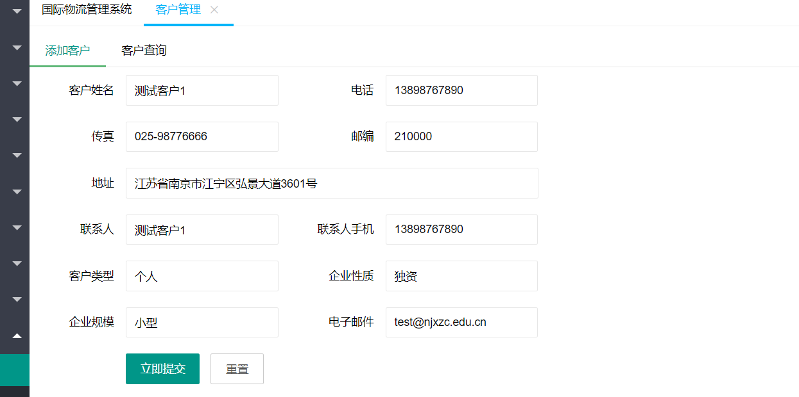


> 可以对客户详细信息进行查看

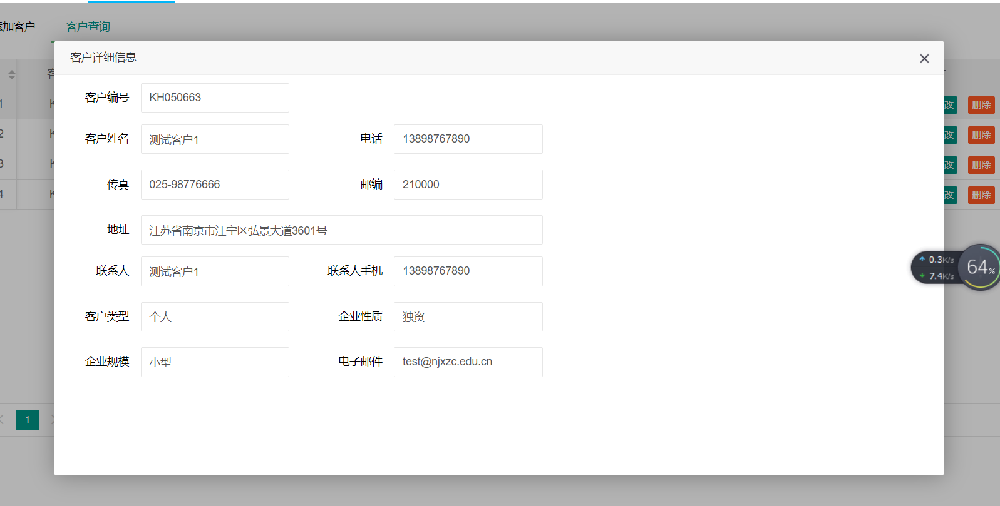

> 可以对客户详细信息进行修改

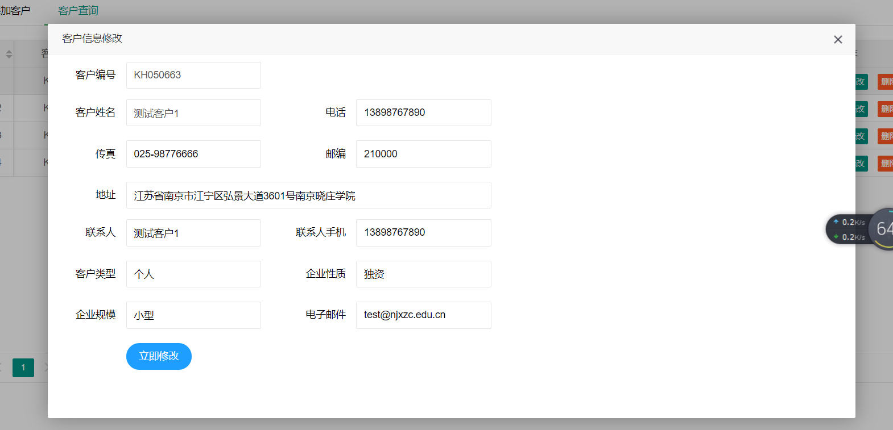

#### 司机管理 | 职员管理

> 司机管理、职员管理同客户管理功能类似，再此不再重复说明

#### 线路管理

> 可以查看数据库中城市及范围信息

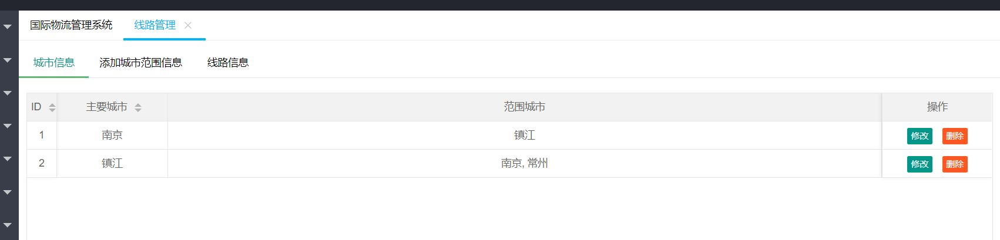

> 可以对没有城市范围信息的城市进行添加


> 城市的线路信息通过城市范围情况，由深度搜索算法（DFS）进行检索生成

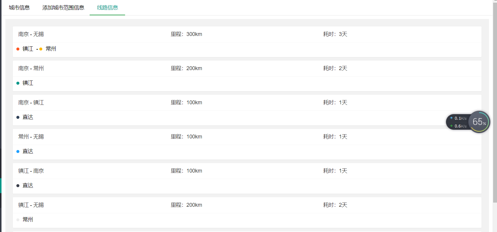

### 系统管理

#### 新建用户组

> 管理员可以新建一个用户组（即部门）

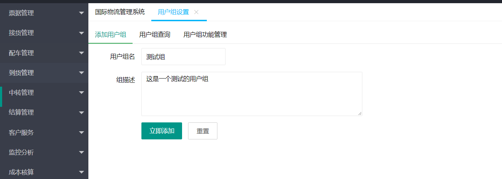


#### 修改用户组信息

> 管理员可以对用户组描述等信息进行修改

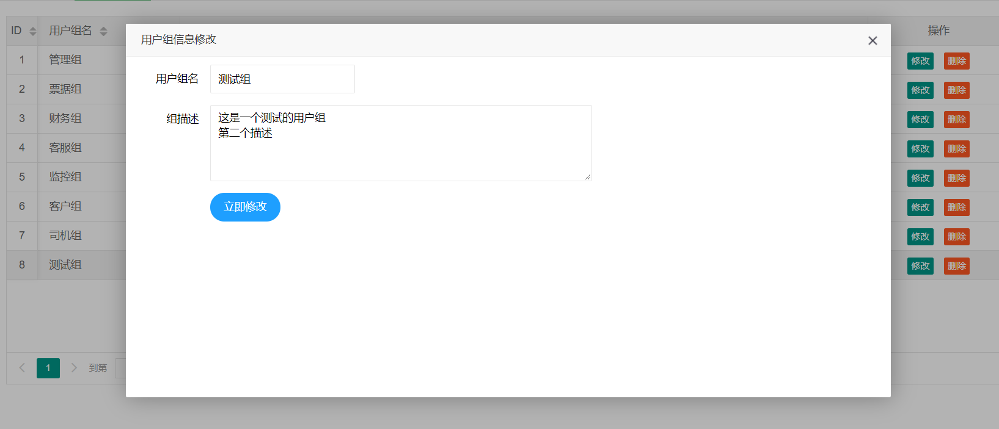


#### 分配用户组功能

> 管理员可以对用户组功能进行分配  
> 在这里对财务组进行功能分配

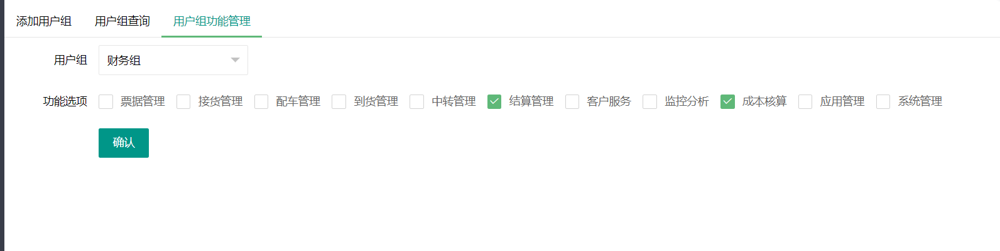

> 登录财务组的一个用户，查看左侧功能栏

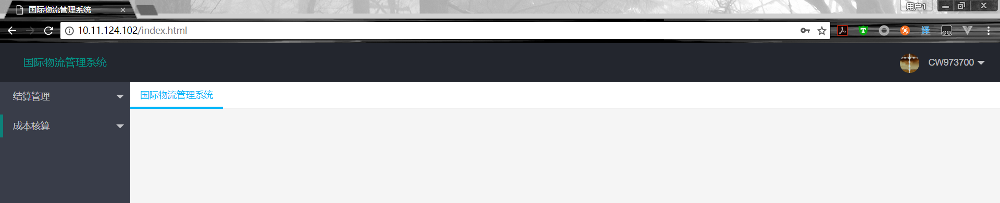

#### 密码修改

> 用户可以对自己的密码进行修改


